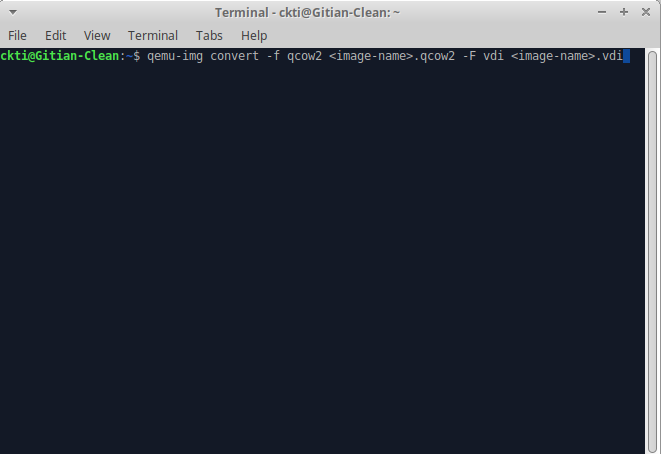
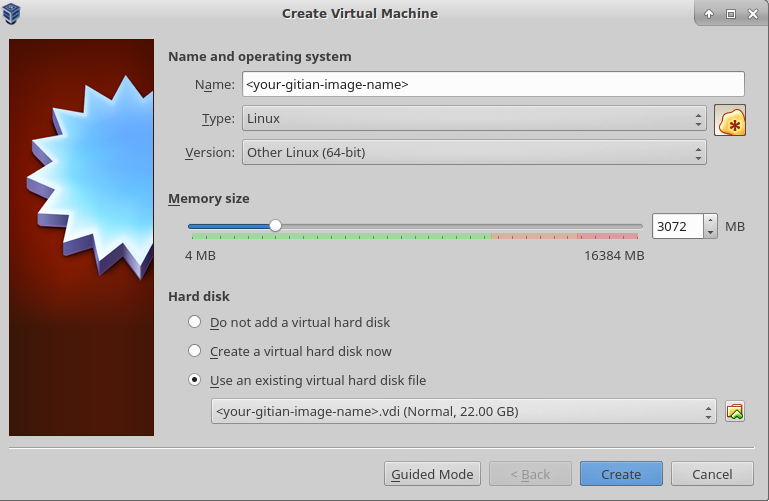

Gitian building
================

*Setup instructions for a Gitian build of Ion Core using a VM or physical system.*

Gitian is the deterministic build process that is used to build the Ion
Core executables. It provides a way to be reasonably sure that the
executables are really built from the source on GitHub. It also makes sure that
the same, tested dependencies are used and statically built into the executable.

Multiple developers build the source code by following a specific descriptor
("recipe"), cryptographically sign the result, and upload the resulting signature.
These results are compared and only if they match, the build is accepted and uploaded
to ioncoin.org.

More independent Gitian builders are needed, which is why this guide exists.
It is preferred you follow these steps yourself instead of using someone else's
VM image to avoid 'contaminating' the build.

Table of Contents
------------------

- [Installing Gitian](#installing-gitian)
- [Setting up the Gitian image](#setting-up-the-gitian-image)
- [Getting and building the inputs](#getting-and-building-the-inputs)
- [Building Ion Core](#building-ion-core)
- [Building an alternative repository](#building-an-alternative-repository)
- [Signing externally](#signing-externally)
- [Uploading signatures](#uploading-signatures)
- [Create a new VirtualBox VM From KVM Image](#create-a-new-virtualbox-vm)

Preparing the Gitian builder host
---------------------------------

The first step is to prepare the host environment that will be used to perform the Gitian builds.
This guide explains how to set up the environment, and how to start the builds.


Any kind of virtualization can be used, for exmple:
- [KVM](http://www.linux-kvm.org/page/Main_Page)
- [LXC](https://linuxcontainers.org/), see also [Gitian host docker container](https://github.com/gdm85/tenku/tree/master/docker/gitian-ion-host/README.md).
- [VirtualBox](https://www.virtualbox.org/)

You can also install Gitian on actual hardware instead of using virtualization.


Installing Gitian
------------------

Re-login as the user `` that was created during installation.
The rest of the steps in this guide will be performed as that user.

There is no `python-vm-builder` package in Debian, so we need to install it from source ourselves,

```bash
wget http://archive.ubuntu.com/ubuntu/pool/universe/v/vm-builder/vm-builder_0.12.4+bzr494.orig.tar.gz
echo "76cbf8c52c391160b2641e7120dbade5afded713afaa6032f733a261f13e6a8e  vm-builder_0.12.4+bzr494.orig.tar.gz" | sha256sum -c
# (verification -- must return OK)
tar -zxvf vm-builder_0.12.4+bzr494.orig.tar.gz
cd vm-builder-0.12.4+bzr494
sudo python setup.py install
cd ..
```

**Note**: When sudo asks for a password, enter the password for the user *debian* not for *root*.

Clone the git repositories for ion and Gitian. (Rename existing folder).

```bash
git clone https://github.com/cevap/gitian-builder.git
git clone https://github.com/cevap/ion.git
git clone https://github.com/cevap/gitian.sigs.git
```

Setting up the Gitian image
-------------------------

Gitian needs a virtual image of the operating system to build in.
Currently this is Ubuntu Trusty x86_64.
This image will be copied and used every time that a build is started to
make sure that the build is deterministic.
Creating the image will take a while, but only has to be done once.
The size of the virtual hard drive must be increased 20Gb is a good suggestion...either by editing the file make-base-vm in the gitian/bin directoy or by patching using the following patch

[contrib/make-base-vm.patch](/contrib/make-base-vm.patch)


Execute the following as user `debian`:

```bash
cd gitian-builder
bin/make-base-vm --lxc --arch amd64 --suite trusty
```

There will be a lot of warnings printed during the build of the image. These can be ignored.

**Note**: When sudo asks for a password, enter the password for the user *debian* not for *root*.

Getting and building the inputs
--------------------------------

At this point you have two options, you can either use the automated script (found in [contrib/gitian-build.sh](/contrib/gitian-build.sh)) or you could manually do everything by following this guide. If you're using the automated script, then run it with the "--setup" command. Afterwards, run it with the "--build" command (example: "contrib/gitian-build.sh -b signer 0.13.0"). Otherwise ignore this.

Follow the instructions in [doc/release-process.md](release-process.md#fetch-and-create-inputs-first-time-or-when-dependency-versions-change)
in the ion repository under 'Fetch and create inputs' to install sources which require
manual intervention. Also optionally follow the next step: 'Seed the Gitian sources cache
and offline git repositories' which will fetch the remaining files required for building
offline.

Building Ion Core
----------------

To build Ion Core (for Linux, OS X and Windows) just follow the steps under 'perform
Gitian builds' in [doc/release-process.md](release-process.md#perform-gitian-builds) in the ion repository.

This may take some time as it will build all the dependencies needed for each descriptor.
These dependencies will be cached after a successful build to avoid rebuilding them when possible.

At any time you can check the package installation and build progress with

```bash
tail -f var/install.log
tail -f var/build.log
```

Output from `gbuild` will look something like

    Initialized empty Git repository in /home/debian/gitian-builder/inputs/ion/.git/
    remote: Counting objects: 57959, done.
    remote: Total 57959 (delta 0), reused 0 (delta 0), pack-reused 57958
    Receiving objects: 100% (57959/57959), 53.76 MiB | 484.00 KiB/s, done.
    Resolving deltas: 100% (41590/41590), done.
    From https://github.com/cevap/ion
    ... (new tags, new branch etc)
    --- Building for trusty amd64 ---
    Stopping target if it is up
    Making a new image copy
    stdin: is not a tty
    Starting target
    Checking if target is up
    Preparing build environment
    Updating apt-get repository (log in var/install.log)
    Installing additional packages (log in var/install.log)
    Grabbing package manifest
    stdin: is not a tty
    Creating build script (var/build-script)
    lxc-start: Connection refused - inotify event with no name (mask 32768)
    Running build script (log in var/build.log)

Building an alternative repository
-----------------------------------

If you want to do a test build of a pull on GitHub it can be useful to point
the Gitian builder at an alternative repository, using the same descriptors
and inputs.

For example:
```bash
URL=https://github.com/cevap/ion.git
COMMIT=2014_03_windows_unicode_path
./bin/gbuild --commit ion=${COMMIT} --url ion=${URL} ../ion/contrib/gitian-descriptors/gitian-linux.yml
./bin/gbuild --commit ion=${COMMIT} --url ion=${URL} ../ion/contrib/gitian-descriptors/gitian-win.yml
./bin/gbuild --commit ion=${COMMIT} --url ion=${URL} ../ion/contrib/gitian-descriptors/gitian-osx.yml
```

Building fully offline
-----------------------

For building fully offline including attaching signatures to unsigned builds, the detached-sigs repository
and the ion git repository with the desired tag must both be available locally, and then gbuild must be
told where to find them. It also requires an apt-cacher-ng which is fully-populated but set to offline mode, or
manually disabling gitian-builder's use of apt-get to update the VM build environment.

To configure apt-cacher-ng as an offline cacher, you will need to first populate its cache with the relevant
files. You must additionally patch target-bin/bootstrap-fixup to set its apt sources to something other than
plain archive.ubuntu.com: us.archive.ubuntu.com works.

So, if you use LXC:

```bash
export PATH="$PATH":/path/to/gitian-builder/libexec
export USE_LXC=1
cd /path/to/gitian-builder
./libexec/make-clean-vm --suite trusty --arch amd64

LXC_ARCH=amd64 LXC_SUITE=trusty on-target -u root apt-get update
LXC_ARCH=amd64 LXC_SUITE=trusty on-target -u root \
  -e DEBIAN_FRONTEND=noninteractive apt-get --no-install-recommends -y install \
  $( sed -ne '/^packages:/,/[^-] .*/ {/^- .*/{s/"//g;s/- //;p}}' ../ion/contrib/gitian-descriptors/*|sort|uniq )
LXC_ARCH=amd64 LXC_SUITE=trusty on-target -u root apt-get -q -y purge grub
LXC_ARCH=amd64 LXC_SUITE=trusty on-target -u root -e DEBIAN_FRONTEND=noninteractive apt-get -y dist-upgrade
```

And then set offline mode for apt-cacher-ng:

```
/etc/apt-cacher-ng/acng.conf
[...]
Offlinemode: 1
[...]

service apt-cacher-ng restart
```

Then when building, override the remote URLs that gbuild would otherwise pull from the Gitian descriptors::
```bash

cd /some/root/path/
git clone https://github.com/ion-core/ion-detached-sigs.git

IONPATH=/some/root/path/ion
SIGPATH=/some/root/path/ion-detached-sigs

./bin/gbuild --url ion=${IONPATH},signature=${SIGPATH} ../ion/contrib/gitian-descriptors/gitian-win-signer.yml
```
Create a new VirtualBox VM
---------------------------
After creating the KVM Gitian environment(s) the qcow2 image(s) should be converted into the vdi format used by Oracle Virtual Box.  Whilst this conversion is not 100% necessary, it should be done to protect the integrity of the Gitian Build images.

In a terminal window run the following command where <image-name\> is the name of your qcow2 image



In the VirtualBox GUI click "New" and choose the following parameters in the wizard:



- Type: Linux, Other Linux (64-bit)

- Memory Size: at least 3072MB, anything less and the build might not complete.

- Hard Disk: Use an existing virtual hard disk, select one of the qcow2 -> vdi images

- Click `Create`

Signing externally
-------------------

If you want to do the PGP signing on another device, that's also possible; just define `SIGNER` as mentioned
and follow the steps in the build process as normal.

    gpg: skipped "laanwj": secret key not available

When you execute `gsign` you will get an error from GPG, which can be ignored. Copy the resulting `.assert` files
in `gitian.sigs` to your signing machine and do

```bash
    gpg --detach-sign ${VERSION}-linux/${SIGNER}/ion-linux-build.assert
    gpg --detach-sign ${VERSION}-win/${SIGNER}/ion-win-build.assert
    gpg --detach-sign ${VERSION}-osx-unsigned/${SIGNER}/ion-osx-build.assert
```

This will create the `.sig` files that can be committed together with the `.assert` files to assert your
Gitian build.

Uploading signatures
---------------------

After building and signing you can push your signatures (both the `.assert` and `.assert.sig` files) to the
[ion-core/gitian.sigs](https://github.com/ion-core/gitian.sigs/) repository, or if that's not possible create a pull
request. You can also mail the files to Wladimir (laanwj@gmail.com) and he will commit them.


